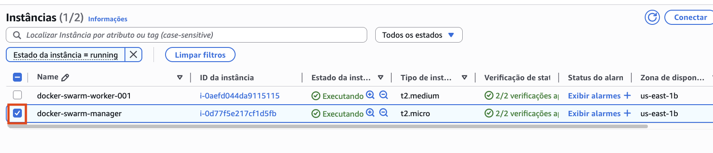
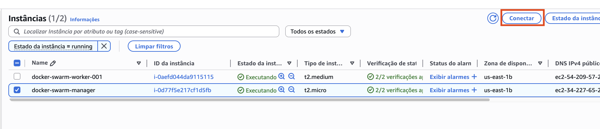
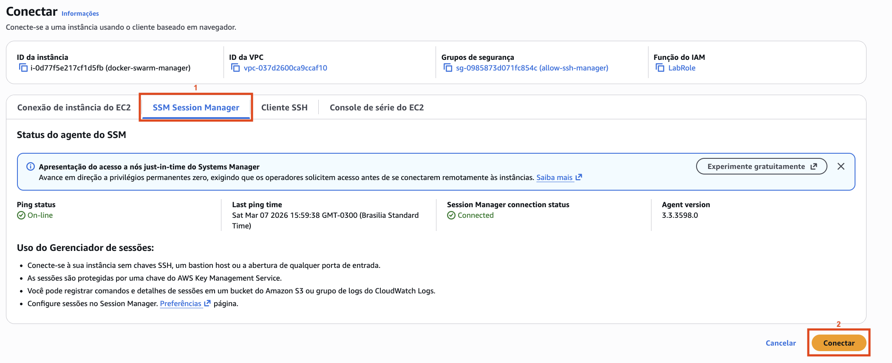
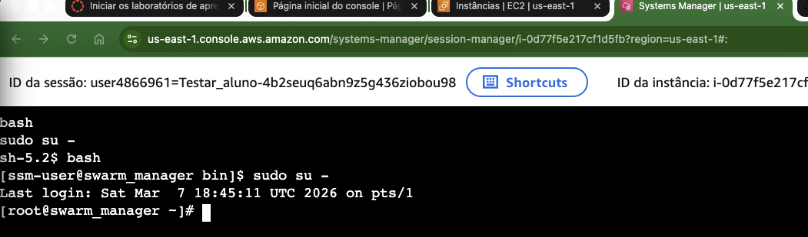
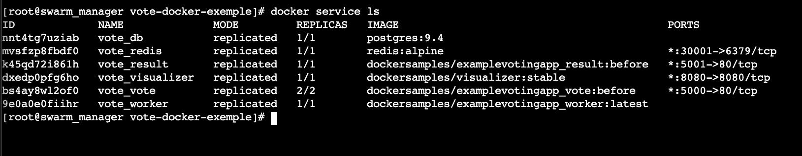
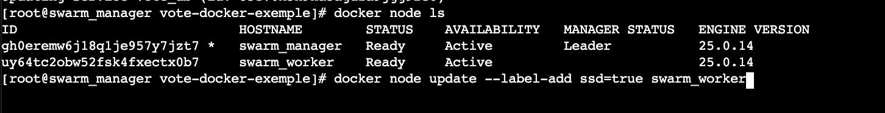

## Conteiners 2.4 - Scale Failover, Node Label

**Antes de começar, execute os passos abaixo para configurar o ambiente caso não tenha feito isso ainda na aula de HOJE: [Preparando Credenciais](../../01-create-codespaces/Inicio-de-aula.md)**

1. Vamos acessar o terminal do nó master do cluster pelo console para fazer a demonstração. Para isso acesse o [link](https://us-east-1.console.aws.amazon.com/ec2/home?region=us-east-1#Instances:instanceState=running) e selecione o nó master criado no módulo anterior.
    
    
2. Com o nó selecionado, clique em `Conectar`
    
    

3. Selecione a aba `Session Manager` e clique em `Conectar`
    
     

4. Se tudo deu certo, você deve estar conectado no terminal do nó master do cluster. Agora vamos para a parte prática da aula.

    

2. Entre na pasta do projeto com o comando `cd /home/ssm-user/vote-docker-exemple`
3. Suba a stack com o comando `docker stack deploy --compose-file docker-compose.yaml vote`
4. Verifique se todos os serviços já estão em execução com o comando `docker service ls`. Note que pode demorar até um minuto para que os serviços subam completamente. Se o serviço estiver com o numero de replicas "0/1" é porque ele ainda esta subindo, aguarde um pouco e rode o comando novamente até que fique como na imagem.
   
   

5. Abra uma aba no seu navegador para monitorar o visualizer. Para isso execute o comando abaixo para pegar o IP do nó manager e a porta do visualizer.
``` shell
TOKEN=$(curl -sX PUT "http://169.254.169.254/latest/api/token" \
  -H "X-aws-ec2-metadata-token-ttl-seconds: 21600")
publicC9Ip=`curl -sH "X-aws-ec2-metadata-token: $TOKEN" http://169.254.169.254/latest/meta-data/public-ipv4` && echo "http://$publicC9Ip:8080"
```

1. Utilize o comando `docker service scale vote_result=20`
2. Vamos aumentar ainda mais o numero de containers do serviço com o comando `docker service scale vote_result=30`, note que o worker recebe todos os novos containers.
3.  Agora que pasosu o pico de acesso, rode `docker service scale vote_result=5`. O cluster volta a ficar equilibrado em numero de containers por nó.

4.  Execute o comando `git fetch && git checkout parte1` para mudar de branch no projeto.
5.  Note que o arquivo compose tem algumas mudanças, tem mais configurações.
6.  Faça um deploy com o novo compose utilizando o comando `docker stack deploy --compose-file docker-compose.yaml vote`, os serviços vão ser todos atualizados porque já existem no cluster.
    
7.  Agora vamos adicionar algumas labels aos hosts. Label de ssd (perfeito para bancos de dados), e GPU.
8.  Execute o comando `docker node ls` e copie o HOSTNAME do nó que <b>não</b> é manager.
    
    

9.  Execute o comando `docker node update --label-add ssd=true HOSTNAMECOPIADO` 
    
    

10. Execute o comando `docker node ls` e copie o HOSTNAME do nó que <b>é</b> manager.
11. Execute o comandos `docker node update --label-add gpu=true HOSTNAMECOPIADO`
12. Para ter certeza que os labels funcionaram execute o comando: 
``` shell
docker node ls -q | xargs docker node inspect \
  -f '[{{ .Description.Hostname }}]: {{ range $k, $v := .Spec.Labels }}{{ $k }}={{ $v }} {{end}}'
```


19.  Atualize seu compose para a versão onde as tags são utilizadas. Para tal execute o comando `git fetch && git checkout parte2`
20. Note que agora os serviços "vote" e "db" dependem de hosts com tags.
21. Execute o novo compose com o comando `docker stack deploy --compose-file docker-compose.yaml vote`
22. Note que assim que o primeiro worker ligou um container db foi colocado nele
        


1.  Caso seu serviço "Worker" não retorne a normalidade é porque atingiu o maximo de tentativas configurada. Force o serviço com o comando `docker service scale vote_worker=1`
    
2.  Execute o comando `docker service scale vote_vote=3`, note que o swarm não coloca o container em outras maquinas mesmo tendo espaço e processamento livre.
3.  Execute o comando `docker service scale vote_vote=1`
4.  remova a stack com o comando `docker stack rm vote`